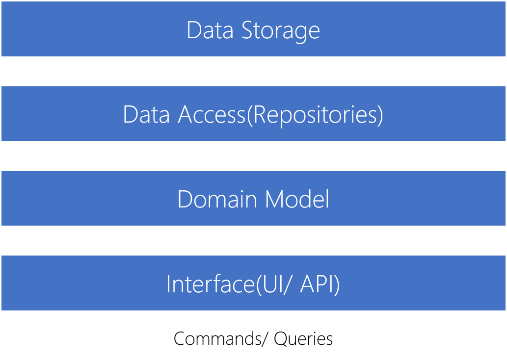
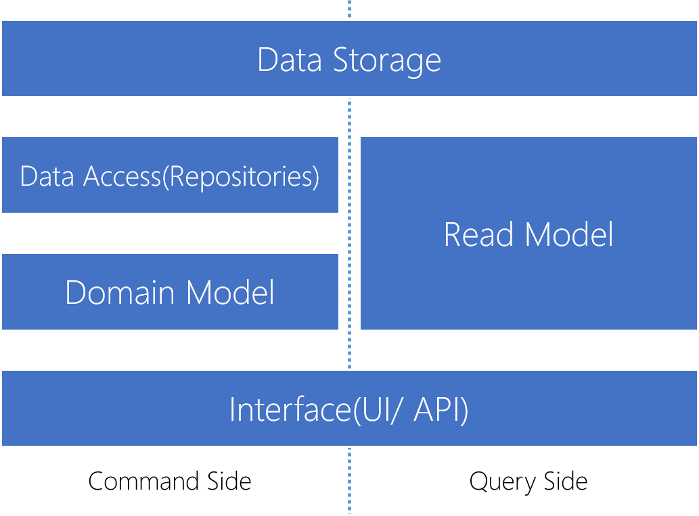
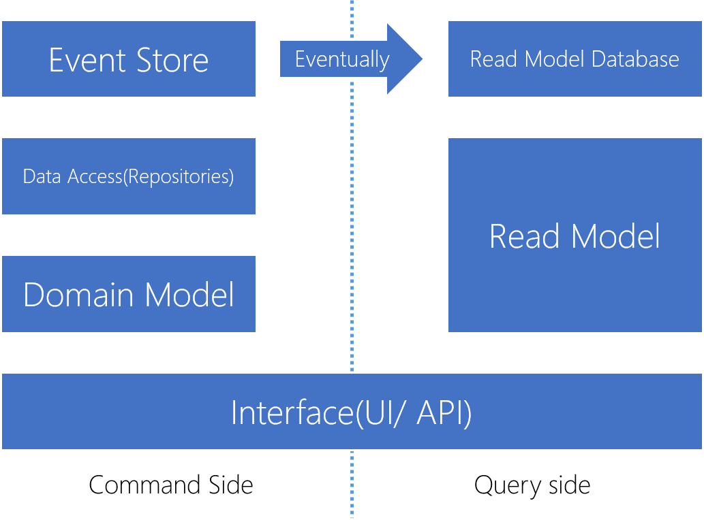

# CQRS 오해

CQRS와 관련 기술들은 .NET 환경을 중심으로 발전해왔고 점차 Java, Ruby 등의 플랫폼으로 확산되고 있습니다. 국내에서는 아직 크게 주목받지는 않지만 최근 CQRS에 대한 관심이 늘어나고 있습니다. CQRS를 처음 접하는 국내 프로그래머들은 혼란스러워하거나 오해를 하곤 합니다. 비단 이런 현상은 CQRS나 국내 환경에 국한되지는 않습니다. CQRS 말고도 여러 기술들이 확산되는 과정에 맹신과 괴담들이 퍼져왔습니다. 또한 해외 커뮤니티에서도 CQRS의 실체에 대해 혼란스러워하는 모습을 어렵지 않게 볼 수 있습니다. 사실 저 또한 CQRS를 처음 공부할 당시 응용기술에 대한 이해보다 CQRS가 무엇인지에 대해 가장 많이 고민했고 몇 차례 주변에의 질문에도 명확한 답변을 얻지는 못했습니다.

# CQRS란?

CQRS는 Command and Query Responsibility Segregation(명령과 조회의 역할 분리)을 나타냅니다. 이름처럼 시스템에서 명령을 처리하는 책임과 조회를 처리하는 책임을 분리하는 것이 CQRS의 핵심입니다. 이제 명령과 조회에 대해 정의할 필요가 있습니다. CQRS에서 명령은 시스템의 상태를 변경하는 작업을 의미하며 조회는 시스템의 상태를 반환하는 작업을 의미합니다. 정리하면, CQRS는 시스템의 상태를 변경하는 작업과 시스템의 상태를 반환하는 작업의 책임을 분리하는 것입니다.

> 모든 연산이 명령과 조회로 쉽게 양분되지는 않습니다. 개념적으로 어려운 경우도 있고 동시성 등 기술적인 문제도 있습니다. Martin Fowler는 스택 자료구조의 `pop()` 연산을 예로 들었습니다. 다른 예로, 사용자 인증토큰 발행 작업은 시스템의 상태를 변경하지 않지만 시스템의 상태를 반환하지도, 멱등성을 가지지도 않습니다.

너무 단순하다고 생각될지 모르겠지만 이것이 전부입니다. 어쩌면 CQRS에 대한 오해는 CQRS가 생각보다 복잡하지 않기 때문일지도 모릅니다. 이 단순한 규칙이 몇 가지 응용기술과 조합되어 시스템에 적용되면 그 모습은 무척이나 다양합니다. 그만큼 CQRS를 설명하는 정보들이 표현하는 구현체의 모습이 제각각이고 여기서 혼란이 시작될 가능성이 있습니다. CQRS를 설명할 때 명령 처리기 패턴(Command Processor Pattern)을 얘기하기도 하고 다른 경우는 다계층 아키텍처(Multitier Architecture)나 이벤트 소싱(Event Sourcing)을 다룹니다. 이것들 모두와 DDD(Domain-Driven Design)를 조합하기도 합니다.

CQRS를 처음으로 소개한 Greg Young은 CQRS는 아주 단순한 패턴(*"CQRS is a very simple pattern"*)이라고 말했습니다. 물론 Greg Young은 DDD의 고통을 해결하기 위해 CQRS를 사용했다고 하지만 DDD에 국한된 기법은 아닙니다. 이 글과 코드는 CQRS의 적용 예를 설명하기 위해 다계층 아키텍처를 사용하지만 이것은 단지 하나의 예시일 뿐 CQRS는 아키텍처 독립적입니다. 다시 강조하지만 CQRS 자체는 복잡하거나 거대하지 않습니다. 지금 당장 시스템에 적용해 볼 수 있으며 경우에 따라 이미 실천하고 있을지도 모릅니다.

> CQRS는 [CQS(Command and Query Separation)](https://en.wikipedia.org/wiki/Command%E2%80%93query_separation) 원리에 기원합니다. 사실 CQRS는 처음엔 CQS의 확장으로 얘기되었습니다. 하지만 CQS는 명령과 조회를 연산 수준에서 분리하는 반면 CQRS는 개체(object)나 시스템(혹은 서브 시스템) 수준에서 분리합니다.

# 단순한 CQRS 적용

CQRS를 적용하는 단순한(하지만 현실과 동떨어질 정도로 단순하지는 않은) 예를 코드와 함께 설명합니다. 예제로 사용되는 시스템은 작은 API 응용프로그램입니다. 사용자를 등록하고 식별자를 사용해 사용자를 조회하는 기능을 제공합니다. 각 API 기능은 Swagger UI를 통해 실행해 볼 수 있습니다.

## Stereotypical 아키텍처

시스템의 첫번째 모습은 CQRS가 적용되어있지 않은 다계층 아키텍처입니다. 이 버전의 전체 코드는 [여기](https://github.com/gyuwon/SimpleCQRS/tree/stereotypical)에서 확인할 수 있습니다.



사용자를 등록하는 API 코드는 다음과 같습니다.

```csharp
[ResponseType(typeof(UserPresentation))]
public async Task<IHttpActionResult> Post(CreateUser command)
{
    UserPresentation user = await _domainLayer.CreateUserAsync(command);
    return CreatedAtRoute("DefaultApi", new { id = user.Id }, user);
}
```

POST HTTP 메서드를 통해 `CreateUser` 명령을 입력받아 도메인 계층에 전달하고 명령이 완료되면 201(Created) 응답을 반환합니다. 응답에는 생성된 자원의 위치를 나타내는 `location` 헤더와 생성된 사용자 엔터티에 대한 본문이 포함됩니다. 이것은 자원을 생성하는 Web API의 흔한 동작입니다. 이 동작을 지원하기 위해 도메인 계층의 `CreateUserAsync()` 메서드는 명령 실행 후 `UserPresentation` 개체를 반환합니다.

도메인 계층의 `CreateUserAsync()` 메서드 코드는 다음과 같습니다.

```csharp
public async Task<UserPresentation> CreateUserAsync(CreateUser command)
{
    int userId = await _repository.InsertAsync(new User
    {
        UserName = command.UserName,
        PasswordHash = _passwordHasher.HashPassword(command.Password)
    });

    User user = await _repository.FindAsync(userId);

    return new UserPresentation
    {
        Id = user.Id,
        UserName = user.UserName
    };
}
```

`CreateUserAsync()` 메서드는 크게 두 가지 작업을 수행합니다. 첫번째는 `CreateUser` 명령에 들어있는 정보를 사용해 새 사용자 엔터티를 생성하는 것이고, 두번째는 생성된 사용자 엔터티를 조회해 표현 계층 모델로 변환해 반환합니다. 영속 모델(`User`) 개체를 그대로 반환하면 `PasswordHash` 속성이 서비스 외부로 노출되는 보안 문제가 발생합니다.

`CreateUserAsync()` 메서드의 엔터티 생성 기능에 대한 단위 테스트 케이스를 작성하면 다음과 같습니다.

```csharp
[TestMethod]
public async Task CreateUserAsync_inserts_new_user_to_repository()
{
    // Arrange
    var random = new Random();
    var userName = "foo";
    string password = random.Next().ToString();
    string passwordHash = random.Next().ToString();

    var repository = Mock.Of<IUsersRepository>();
    var passwordHasher = Mock.Of<IPasswordHasher>(
        x => x.HashPassword(password) == passwordHash);

    var sut = new UsersDomainModel(repository, passwordHasher);

    Mock.Get(repository)
        .Setup(x => x.FindAsync(It.IsAny<int>()))
        .ReturnsAsync(new User());

    // Act
    await sut.CreateUserAsync(new CreateUser
    {
        UserName = userName,
        Password = password
    });

    // Assert
    Mock<IUsersRepository> mock = Mock.Get(repository);
    mock.Verify(repo =>
        repo.InsertAsync(It.Is<User>(user =>
            user.UserName == userName &&
            user.PasswordHash == passwordHash)));
}
```

테스트 케이스 'Arrange' 단계의 마지막 3줄의 코드를 살펴보면,

```csharp
Mock.Get(repository)
    .Setup(x => x.FindAsync(It.IsAny<int>()))
    .ReturnsAsync(new User());
```

테스트 케이스가 검증하고자하는 내용과는 무관한 것을 알 수 있습니다. 테스트 케이스의 관심사는 새 엔터티가 잘 추가되는지이지 메서드가 어떤 값을 반환하는지가 아닙니다. 반환값에 대한 검증은 별도의 테스트 케이스가 필요합니다. 하지만 위 코드가 빠지면 실제 코드에 문제가 없음에도 불구하고 `NullReferenceException`이 발생해 테스트 케이스가 실패합니다. 저장소에 대한 테스트 대역이 `FindAsync()` 메서드 호출에 대해 `null` 참조를 반환하기 때문입니다.

이것은 일부 사례일 뿐입니다. 사용자를 생성하거나 사용자 정보를 조회하는 논리가 확장될수록 이와같은 문제는 더 많이 발생합니다. 사용자 생성에 이메일 주소를 입력받아 이메일 소유 검증 메일을 전송하거나 프로필 사진이 적용되어 표현 계층 모델 작성이 지금보다 복잡해지는 경우를 생각해보세요. 그로 인해 기존 테스트 케이스와 신규 테스트 케이스는 각 검증 대상 논리와 무관하게 점점 난해해지며 더 중요하게 이것은 대상 코드가 불필요하게 복잡하다는 반증입니다. ***"Listen to Your Tests."***

## CQRS 적용

이제 도메인 계층의 역할을 분리해 Web API의 기능은 그대로 유지하면서 논리를 단순하게 변경합니다. CQRS가 적용된 버전의 전체 코드는 [여기](https://github.com/gyuwon/SimpleCQRS/tree/cqrs)에서 확인할 수 있습니다.

사용자 엔터티에 대한 조회 작업을 읽기 모델로 분리하고 API 계층이 응답 본문 작성을 위해 읽기 모델을 사용하도록 수정하면 `UsersDomainModel.CreateUserAsync()` 메서드는 더이상 값을 반환할 필요가 없으며 새 엔터티 생성에 대한 책임만 가집니다. 기존 도메인 계층 코드의 변화를 살펴보면 다음과 같습니다.

```csharp
public async Task CreateUserAsync(CreateUser command)
{
    await _repository.InsertAsync(new User
    {
        Id = command.UserId,
        UserName = command.UserName,
        PasswordHash = _passwordHasher.HashPassword(command.Password)
    });
}
```

위 코드는 조회 작업이 제거된 것 외에 중요한 변화를 하나 더 가집니다. `User` 엔터티를 저장하기 전에 식별자(`Id`)를 지정한다는 것입니다. 그리고 이 식별자는 `CreateUser` 명령을 통해 전달됩니다. 즉 `CreateUserAsync()` 메서드가 호출되기 전에 식별자가 정해집니다. 이 조건을 만족하기 위해 엔터티 식별자 형식을 `Guid`로 변경합니다. `Guid`를 식별자 형식으로 사용하면 엔터티가 데이터 저장소에 영속되기 전에 식별자를 결정하면서도 기존 엔터티의 식별자와 중복되지 않음을 보장할 수 있습니다. 그래서 명령과 조회 작업을 잘 분리할 수 있게 도와주며 이런 이유로 CQRS에서는 일반적으로 `Guid`를 엔터티 식별자로 사용합니다.

> 여기서 언급된 특성 외에 `Guid`는 엔터티 식별자로서 고려해야할 부분이 더 있습니다.

`CreateUserAsync_inserts_new_user_to_repository` 테스트 케이스에서 명령 작업과 무관한 코드는 제거됩니다.

```csharp
[TestMethod]
public async Task CreateUserAsync_inserts_new_user_to_repository()
{
    // Arrange
    var random = new Random();
    var command = new CreateUser
    {
        UserName = "foo",
        Password = random.Next().ToString()
    };
    string passwordHash = random.Next().ToString();

    var repository = Mock.Of<IUsersRepository>();
    var passwordHasher = Mock.Of<IPasswordHasher>(
        x => x.HashPassword(command.Password) == passwordHash);

    var sut = new UsersDomainModel(repository, passwordHasher);

    // Act
    await sut.CreateUserAsync(command);

    // Assert
    Mock<IUsersRepository> mock = Mock.Get(repository);
    mock.Verify(repo =>
        repo.InsertAsync(It.Is<User>(user =>
            user.Id == command.UserId &&
            user.UserName == command.UserName &&
            user.PasswordHash == passwordHash)));
}
```

읽기 모델을 담당하는 `UsersReadModelFacade`는 쓰기 모델에 비해 상대적으로 단순합니다. 다음 코드는 식별자를 사용해 사용자 정보를 조회하는 메서드입니다.

```csharp
public async Task<UserPresentation> FindByIdAsync(Guid userId)
{
    using (SimpleCQRSContext db = _dbContextFactory.Invoke())
    {
        return await db.Users
            .FilterById(userId)
            .ToPresentation()
            .SingleOrDefaultAsync();
    }
}
```

`FindByIdAsync()` 메서드는 LET(Layered Expression Trees)를 사용해 쿼리를 작성하고 직접 요청합니다. LET은 도메인 친화적인 어휘를 사용해 직관적이고 계층적인 쿼리를 작성할 수 있도록 도와줍니다. 재활용이 용이하다는 것도 LET의 장점입니다. 사용자 조회 작업에 사용된 LET은 다음과 같이 구현됩니다.

```csharp
using System;
using System.Linq;
using SimpleCQRS.Models.Data;
using SimpleCQRS.Models.Presentation;

namespace SimpleCQRS.ReadModel
{
    public static class LetExtensions
    {
        public static IQueryable<User> FilterById(this IQueryable<User> query, Guid userId)
        {
            return query.Where(e => e.Id == userId);
        }

        public static IQueryable<UserPresentation> ToPresentation(this IQueryable<User> query)
        {
            return from e in query
                   select new UserPresentation
                   {
                       Id = e.Id,
                       UserName = e.UserName
                   };
        }
    }
}
```

마지막으로 API 계층의 변화를 확인합니다.

```csharp
[ResponseType(typeof(UserPresentation))]
public async Task<IHttpActionResult> Post(CreateUser command)
{
    await _domainLayer.CreateUserAsync(command);
    UserPresentation user = await
        _readModel.FindByIdAsync(command.UserId);
    return CreatedAtRoute("DefaultApi", new { id = user.Id }, user);
}
```

사용자 엔터티를 생성하는 작업과 생성된 정보를 조회하는 작업을 각각 다른 개체에 의존하는 것을 알 수 있습니다.

CQRS를 적용해 변경된 아키텍처를 그림으로 표현하면 다음과 같습니다.



# 정리

설명과 코드를 통해 CQRS의 의미와 CQRS가 그렇게 거대하고 복잡하지 않다는 것을 알게되었습니다. CQRS는 그 이름처럼 명령과 조회의 책임을 분리하는 것이 핵심입니다. 지금 당장 기존 시스템의 일부에 CQRS를 적용해 복잡도를 낮추는 것도 어렵지 않습니다.

하지만 CQRS는 더 복잡하고 어려운 시나리오에서도 유용하며 흔히 다양한 기술과 조합되어 사용됩니다. 예를 들어 이벤트 소싱(Event Sourcing)은 CQRS 적용이 필수적이라고 알려져있습니다.


